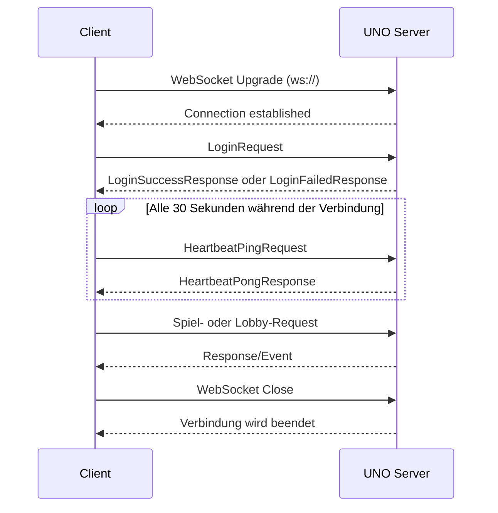

# UNO Protocol

Dieses Dokument beschreibt das öffentliche Kommunikationsprotokoll zwischen
UNO-Servern und allen Clients. Es ist unabhängig von Java, JavaFX, Android oder
einem bestimmten Browser-Framework.

## 1. Transport

Clients verbinden sich per unverschlüsseltem WebSocket mit dem Server:

```text
ws://server.example:59362
```

Die Verbindung und damit auch die Login-Payload sind bei `ws://` nicht
verschlüsselt. Der öffentliche Port bleibt `59362`.

Der Transport verwendet WebSocket-Textnachrichten mit UTF-8-kodiertem JSON.
Binäre WebSocket-Nachrichten werden nicht benötigt.

## 2. Nachrichtenformat

Jede Nachricht besitzt dieselbe Hülle:

```json
{
  "version": 1,
  "type": "LoginRequest",
  "payload": {
    "username": "alice",
    "password": "secret"
  }
}
```

| Feld | Typ | Bedeutung |
|---|---|---|
| `version` | Zahl | Version des öffentlichen Protokolls; aktuell `1` |
| `type` | String | Eindeutiger Nachrichtenname |
| `payload` | Objekt | Daten der Nachricht |

Ein Client muss eine unbekannte Protokollversion ablehnen. Unbekannte
Payload-Felder dürfen ignoriert werden. Dadurch können innerhalb derselben
Protokollversion optionale Felder ergänzt werden.

Die Java-Request-/Response-Records sind nur interne DTOs der Java-Implementierung.
Sie werden niemals als Java-Serialisierung übertragen. Ein Web- oder
Android-Client implementiert ausschließlich diese JSON-Hülle und die
Payload-Strukturen.

## 3. Verbindungsablauf



Der Client darf Requests erst nach erfolgreichem WebSocket-Handshake senden.
Nach dem Login können Lobby- und Spielnachrichten gesendet werden. Responses
werden asynchron übertragen; ein Client darf deshalb nicht davon ausgehen,
dass die Antwort unmittelbar nach dem Request eintrifft.

## 4. Client-Requests

Der Client sendet Nachrichten mit diesen `type`-Werten:

| Type | Payload |
|---|---|
| `LoginRequest` | `username`, `password` |
| `CreateAccountRequest` | `username`, `lastName`, `firstName`, `email`, `password`, optional `code` |
| `CheckIfUserAlreadyExistsRequest` | `username`, `email` |
| `ForgotPasswordRequest` | `email` |
| `ForgotPasswordSendCodeRequest` | `code` |
| `ChangePasswordRequest` | `email`, `code`, `newPassword` |
| `CreateLobbyRequest` | `user` |
| `JoinLobbyRequest` | `lobbyId` |
| `LeaveLobbyRequest` | `user` |
| `SendChatMessageRequest` | `message`, `user` |
| `StartGameRequest` | `user` |
| `ReadyInGameTableRequest` | `player` |
| `CardPlayedRequest` | `card`, `drawPenaltyValue`, `player`, `chosenColor` |
| `RequestCardRequest` | `player`, `amount` |
| `SayUnoRequest` | `player` |
| `SetProfileImageRequest` | `user`, `imageData` |
| `HeartbeatPingRequest` | `timestamp` |

Beispiel für eine Lobby:

```json
{
  "version": 1,
  "type": "JoinLobbyRequest",
  "payload": {
    "lobbyId": 12
  }
}
```

## 5. Server-Responses und Events

Responses werden vom Server über dieselbe WebSocket-Verbindung gesendet:

| Type | Payload |
|---|---|
| `LoginSuccessResponse` | `user` |
| `LoginFailedResponse` | `errorCode` |
| `CreateAccountSuccessResponse` | `user` |
| `CreateAccountFailedResponse` | `status` |
| `CheckIfUserAlreadyExistsResponse` | `username`, `email`, `userAlreadyExists`, `emailAlreadyExists` |
| `ForgotPasswordResponse` | `status` |
| `LobbyInfoResponse` | `lobbyId`, `status`, `users` |
| `LobbyNotFoundResponse` | `user` |
| `LobbyJoinRefusedResponse` | `user`, `lobbyInfo` |
| `ReceiveChatMessageResponse` | `message`, `user` |
| `StartGameResponse` | `enemies` |
| `CardAddResponse` | `card` |
| `PlayerGetResponse` | `player` |
| `StackInfoResponse` | `statusCode` |
| `UpdateEnemyResponse` | `enemy` |
| `GameTurnResponse` | `enemyIndex`, `card`, `drawPenaltyValue`, `nextPlayerIndex`, `directionClockwise`, `currentColor` |
| `EnemyDrawnCardsResponse` | `playerIndex`, `cardsDrawn` |
| `GameOverResponse` | `players`, `leftPlayers` |
| `UnoNotificationResponse` | `username`, `didSayUno` |
| `HeartbeatPongResponse` | leerer Payload `{}` |

Der Server kann Responses auch als Events an mehrere Spieler einer Lobby
schicken. Deshalb muss ein Client auch Nachrichten verarbeiten, die nicht
direkt auf seinen letzten Request folgen.

Beispiel eines Server-Events:

```json
{
  "version": 1,
  "type": "UnoNotificationResponse",
  "payload": {
    "username": "alice",
    "didSayUno": true
  }
}
```

## 6. Gemeinsame Datenobjekte

### User

```json
{
  "id": 7,
  "username": "alice",
  "lastName": "Mustermann",
  "firstName": "Alice",
  "email": "alice@example.com",
  "gamesWon": 4,
  "gamesLost": 2,
  "createdAt": "2026-10-07T16:00:00.000+00:00",
  "lastLogin": "2026-10-07T18:00:00.000+00:00",
  "profileImageData": "BASE64_DATA"
}
```

Passwort-Hashes und Passwort-Salts gehören nicht in Client-Payloads. Clients
senden nur das Klartextpasswort innerhalb einer TLS-geschützten
`ws://`-Verbindung. Der Server speichert das Passwort nicht im Klartext.

### Card

```json
{
  "cardValue": 5,
  "cardColour": "red",
  "chosenColour": null,
  "cardId": "unique-card-id"
}
```

Kartenwerte `0` bis `9` sind Zahlenkarten. `10` steht für Aussetzen, `11` für
Richtungswechsel, `12` für Zieh Zwei, `13` für Farbwahl und `14` für Zieh Vier
mit Farbwahl.

### Enemy

```json
{
  "username": "bob",
  "currentTurn": false,
  "handSize": 6,
  "playerIndex": 1,
  "passive": false,
  "imageBytes": "BASE64_DATA"
}
```

### Player

```json
{
  "username": "alice",
  "currentTurn": true,
  "hand": [],
  "enemies": [],
  "playerIndex": 0,
  "ready": true,
  "passive": false,
  "imageBytes": "BASE64_DATA"
}
```

### Binärdaten

Java-`byte[]`-Felder werden als Base64-Strings übertragen. Das betrifft
Profilbilder und Bilddaten in `User`, `Player`, `Enemy` sowie
`SetProfileImageRequest.imageData`.

## 7. Fehler- und Verbindungsverhalten

Ein Client sollte folgende Fälle behandeln:

1. Ungültiges JSON oder eine ungültige Nachrichtenhülle: Nachricht verwerfen
   und die Verbindung bei Bedarf neu aufbauen.
2. Unbekannter `type`: Nachricht ignorieren und die Verbindung offen lassen.
3. Unbekannte `version`: Verbindung nicht als kompatibel verwenden.
4. WebSocket-Schließung oder Netzwerkfehler: UI über die verlorene Verbindung
   informieren und mit Backoff erneut verbinden.
5. Keine Heartbeat-Antwort: Verbindung als unterbrochen betrachten.

Der Server verarbeitet ungültige Nachrichten nicht als gültige Requests. Ein
Client darf Fehlermeldungen nicht als erfolgreiche Login-, Lobby- oder
Spielantwort interpretieren.

## 8. Minimaler Browser-Client

```javascript
const socket = new WebSocket("ws://server.example:59362");

socket.onopen = () => {
  socket.send(JSON.stringify({
    version: 1,
    type: "LoginRequest",
    payload: {
      username: "alice",
      password: "secret"
    }
  }));
};

socket.onmessage = (event) => {
  const message = JSON.parse(event.data);
  if (message.version !== 1) return;
  console.log(message.type, message.payload);
};
```

Für eine Web-App muss die Seite selbst über HTTPS ausgeliefert werden, damit
der Browser eine `ws://`-Verbindung verwenden kann. Android-Clients können
dieselbe Nachrichtenstruktur mit jeder WebSocket-Bibliothek verwenden.

## 9. Kompatibilität

Die Protokollversion ist derzeit `1`. Neue Nachrichten können hinzugefügt
werden, ohne bestehende Clients zu brechen. Eine Änderung bestehender
Pflichtfelder oder der Bedeutung eines bestehenden `type` erfordert eine neue
Protokollversion.
